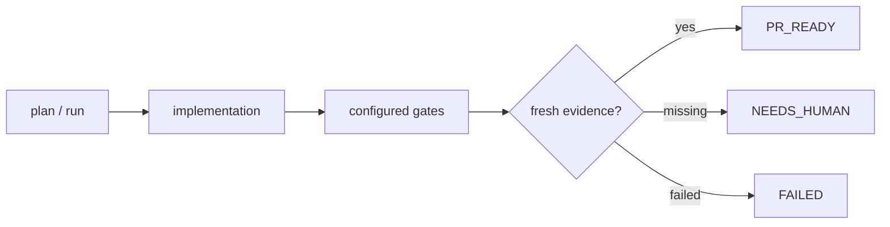

# AI Agent Stack

A zero-footprint, token-aware workflow for using Claude Code and Codex over existing repositories.

The stack prepares bounded implementation context, records fresh validation evidence and certifies whether a change is ready for human review. Framework state stays outside the repository being changed.

Current release: see [`VERSION`](VERSION). Changes between releases are recorded in [`CHANGELOG.md`](CHANGELOG.md).

## Quickstart

```bash
git clone https://github.com/marianozamora/ai-agent-stack.git
cd ai-agent-stack
./install.sh
```

Ensure `~/.local/bin` is on `PATH`. Then, inside a Git repository:

```bash
ai init
ai doctor

# Configure project-specific deterministic checks once.
ai validators set --adapter exit-code --evidence "Tests passed" checks -- npm test
ai validators set --adapter exit-code --evidence "Regression suite passed" regression -- npm run test:regression
ai validators install

# Run a task.
ai plan "implement ticket #1450" --task-id 1450
ai run "implement ticket #1450" --task-id 1450
ai pipeline --resume --task-id 1450
ai ready --task-id 1450
```

Use `ai plan` when another agent will consume the generated prompt, or `ai run` to launch Claude directly. `ai pipeline` executes configured gates; `ai ready` only evaluates recorded, fresh evidence and never launches a model.

See the generated [command reference](docs/commands.md) for every command and flag, and the [field guide](docs/field-guide.md) for the complete lifecycle diagrams.

## Specifications as input

The PR contract (`objective`, `acceptance`, `must_not_change`, `risk_notes`) is what every gate measures the change against, so where its acceptance criteria come from matters more than any other input.

`ai start --ticket-file` fills an empty acceptance list from a document — a pasted ticket, or a [spec-kit](https://github.com/github/spec-kit) `spec.md`, whose "Acceptance Scenarios" and "Functional Requirements" sections are both read without a converter:

```bash
ai start 1450 --ticket-file .specify/specs/042-checkout/spec.md
```

It never overwrites a human-authored list, only fills a blank one. Spec-kit's `[NEEDS CLARIFICATION: ...]` markers are carried through rather than silently accepted.

`ai clarify` then checks that contract before a model is launched:

```bash
ai clarify        # exits NEEDS_HUMAN on criteria nothing could verify
```

It is deterministic — no model, no network, no tokens — and it never edits the contract: a criterion an agent invented is exactly what the `contract` gate exists to reject. It moves that gate's failure left, from after the implementation to before it. Passing is a pattern check, not a sufficiency review.

A project that already keeps its conventions in a document (`CONTRIBUTING.md`, `docs/conventions.md`, a spec-kit `.specify/memory/constitution.md`) can turn them into rules without retyping them:

```bash
ai rules import CONTRIBUTING.md            # proposes; writes nothing
ai rules import CONTRIBUTING.md --confirm  # adds them to external state
```

The document is only read. The rules land in external state like every other rule, and a human still reviews the list.

## Deployment

`ai deploy` is detection-only by default and never mutates anything. Documenting and running a deploy is opt-in and explicit:

```bash
ai deploy                      # detect Docker/CI/PaaS/infra/scripts/docs tooling (unchanged, back-compat)
ai deploy plan                 # ask Codex (read-only) for a dev runbook + a suggested command
                               # review the runbook written under external state, e.g.
                               # ~/.config/ai-agent-stack/repos/<id>/deploy-runbook.md
ai deploy set --evidence "service responds on :8080" dev -- ./deploy.sh dev
ai deploy run dev              # dry run: prints what would execute, executes nothing
ai deploy run dev --execute    # actually deploys; blocked inside a gate/validator environment
```

A deploy is not a gate: it never runs as part of `ai pipeline` and never gates PR readiness. The runbook is Codex's read-only, best-effort *suggestion* — nothing from it is ever auto-written into the deploy configuration; a human reviews it and declares the real command with `ai deploy set`. All runbook and run-record state lives outside the target repository, under external state (`ai path`/`ai status`), the same as every other framework artifact.

## Workflow



Every gate result is bound to a fingerprint of the repository, index, base, plan, contracts, rules and validator configuration. A relevant change invalidates prior evidence. Resume only reuses evidence whose fingerprint and artifact hashes still match.

The default gate order is:

```text
cleanup → checks → regression → contract → review → security
        → ponytail → design → summary → provenance
```

Review, security and design are included according to profile, risk and task inputs.

## Profiles

| Profile | Skills | Raw files | Review files | Findings | Usage budget |
|---|---:|---:|---:|---:|---:|
| `fast` | 1 | 4 | 5 | 3 | 40,000 tokens |
| `standard` | 2 | 8 | 10 | 3 | 120,000 tokens |
| `strict` | 3 | 12 | 15 | 5 | 250,000 tokens |

Strict means stronger evidence and review, not unlimited context or agent debate.

## Skills

Skills resolve in a cascade, most specific first: a repository's own skills shadow the ones bundled with the stack.

```bash
ai skill list                       # [repo] marks a skill this repository added
ai skill create house-style --repo --category quality --prompt '...'
```

A repo-scoped skill lives in that repository's external state, not in the checkout, and may deliberately reuse a bundled skill's name to replace it here without forking the stack. Shadowing replaces the whole definition rather than merging fields.

## Capabilities

The orchestration prompt used to route through Code Review Graph, Graphify, CodeGraph, Context7 and RTK unconditionally, with no check that any of them were actually installed — and RTK and CodeGraph were never once verified present anywhere in the codebase. A capability that isn't there appears nowhere in the prompt: not a status line, not a context-order entry, not a budget cap. The model never learns it exists, so it never routes through it and never burns a retry finding out it can't.

```bash
ai capabilities list             # what's detected, disabled, or missing
ai capabilities disable rtk      # force one off regardless of what's installed
```

Detection is by binary presence alone, exactly like the builder/reviewer providers. Disabling a capability changes what a validator is told, so it invalidates recorded evidence the same way disabling a skill does.

## State and privacy boundary

```text
~/.local/share/ai-agent-stack/           # installed engine
~/.config/ai-agent-stack/repos/<id>/     # contracts, gates, rules, metrics, caches
~/work/company-repo/                     # no framework state committed here
```

`metrics.jsonl` remains the human-readable audit source. A disposable `metrics.sqlite3` index makes task/gate queries incremental and is rebuilt automatically after the JSONL file is rewritten or removed.

Optional integrations include Context7, Graphify, CodeGraph, Code Review Graph, Figma MCP and RTK. Missing optional tools degrade to explicit status rather than silently becoming evidence.

## Guarantees and limits

- Gate evidence is reproducible and invalidated when its inputs change.
- Semantic validators run through a configured reviewer (Codex by default) read-only and require structured verdicts; see `ai providers` to inspect or swap the builder/reviewer.
- Learned lessons require human confirmation and cannot relax required gates.
- Token/context limits are profile-bound; missing usage remains unreported rather than estimated.
- `PR_READY` means the configured evidence is fresh. It is not permission to merge or deploy without the repository's normal human and CI controls.

## Development

Fast checks used for pull requests:

```bash
ruff check .
mypy ai_stack
python3 scripts/generate_command_reference.py --check
python3 -m pytest -q --ignore=tests/test_workflow.py
bash tests/package_smoke.sh
bash tests/smoke.sh
```

The subprocess-heavy matrix runs after merges, weekly and on demand:

```bash
python3 -m pytest -n auto -q --ignore=tests/test_workflow.py
python3 -m pytest -q tests/test_workflow.py
python3 -m unittest discover -s tests
```

Architecture and design rationale live in [docs/architecture.md](docs/architecture.md). Planned work lives in [ROADMAP.md](ROADMAP.md).
