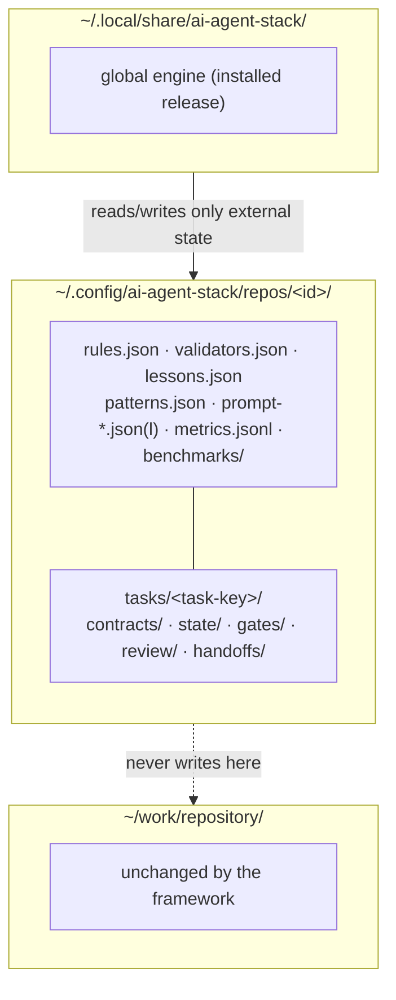
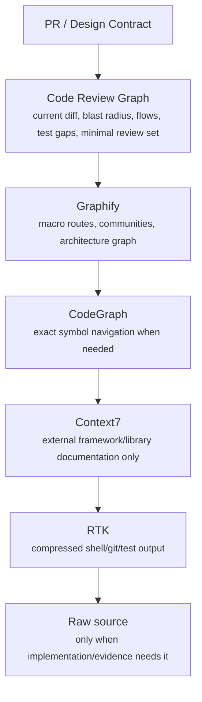
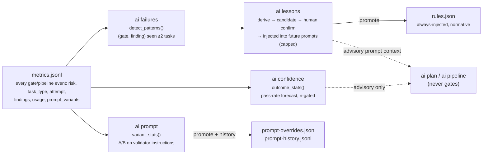

# Architecture

AI Agent Stack is a zero-footprint overlay for existing repositories.



The repository fingerprint is derived from the normalized `origin` URL (or the local root if no remote exists). Moving a checkout therefore does not normally lose its learned profile/rules.

## Module layout

`ai_stack/` is a flat directory of scripts, not a Python package (no
`__init__.py`) — every invocation path (`bin/ai`, the test suite, the bundled
validators' recursive `ai validate` call, a benchmark sandbox) execs
`ai_stack/cli.py` fresh, so every inter-module import is a bare
same-directory `from <module> import <name>`, matching the existing
`workflow`/`validators` convention. `cli.py` itself is a thin entry point
(`parser()` + `main()`, ~130 lines) that imports its command handlers from:

- `core.py` — git/JSON/state primitives (`repo_state`, `task_state`,
  `load_json`/`save_json`), the risk/routing policy (`classify`,
  `context_caps`, `required_gates`), and the mutable `TASK_ID` — the module
  everything else depends on, imported by nothing else in the graph.
- `metrics.py`, `skills.py`, `crg.py`, `tools.py` — self-contained domains
  (usage log, skill router, Code Review Graph, Context7/Graphify/Figma
  wrappers), each depending only on `core`.
- `prompts.py`, `learning.py` — the v0.8 "Learning" surface (`ai prompt`,
  `ai lessons`/`ai failures`/`ai confidence`), each depending on `core` and
  `metrics`.
- `repo.py`, `benchmark.py` — depend additionally on `skills`/`crg`.
- `lifecycle.py` (`ai plan`/`ai run`/`ai ticket`/`ai handoff`) and `gates.py`
  (`ai gate`/`ai pipeline`/`ai ready`/validator config) sit at the top of the
  graph, each depending on several of the modules above.

The boundary rule: a function lives with the domain that owns the external
state it reads or writes (for example, `metrics.py` owns both the audited
`metrics.jsonl` source and its disposable SQLite query index); a primitive used by two or more domains moves down into
`core.py` rather than one domain importing another's helper. This is a pure
reorganization — no command, flag, output string, or file format changed.

## Lint and format policy

`ruff check` (`F`/`E9`/`B`/`UP`) is blocking in CI: real correctness and bug
lints only — unused imports/names, syntax errors, common bug patterns,
outdated syntax. `mypy` is also blocking and checks typed JSON/dict boundaries.
`ruff format --check` remains advisory (`continue-on-error`)
**permanently**, by deliberate decision, not as a pending step. This
codebase's terse style — semicolon-joined statements, one-line function
bodies, minimal vertical whitespace — is intentional throughout, not
unformatted code; `ruff format`'s PEP8-expanded output would rewrite the
entire ~2500-line codebase in one diff to enforce a style preference, not fix
a defect, breaking `git blame` continuity for no correctness benefit. The
format-check step stays wired up only as an informational signal for anyone
curious how far the tree has drifted from PEP8 defaults, never as a gate.

## Test categories

`tests/` uses a naming convention rather than a test framework's tagging
feature (no `pytest.mark.*`, since CI's actual test runner is stdlib
`unittest discover`, not `pytest` - `pytest` only reads these same
`unittest.TestCase` files locally as a convenience, per the zero-dependency
stance). The category is the filename:

- `test_core_helpers.py`, `test_skills_create.py` — **unit**: import a module
  directly off `sys.path` (no subprocess), for pure functions and
  command handlers that take an `argparse.Namespace` directly.
- `test_workflow.py`, `test_workflow_helpers.py` — **integration**: drive the
  real `ai_stack/cli.py` entry point as a subprocess against a throwaway git
  repo, exercising the full CLI/argparse/state-file path.
- `test_performance_budgets.py` — **performance/budget**: pins
  `enforce_budget()`'s exact boundary and confirms a profile's
  `context_caps()['context_chars']` actually changes pass/fail through the
  full `build_prompt()` path, not just in the caps table.
- `test_security_injection.py` — **security**: pins the mitigations for the
  two user-string-into-subprocess-argv surfaces this project has (`--base`
  reaching `git`, a skill name reaching a filesystem path). There's no
  `shell=True`/`os.system` anywhere in `ai_stack/` (`core.run()` always calls
  `subprocess.run` with an argv list), so classic shell metacharacter
  injection isn't a reachable class here; what's tested is git *option*
  injection via a ref-shaped `--base` value and path traversal via an
  unvalidated skill name.

Run one category in isolation with `unittest`'s own `-p` pattern (no plugin
needed): `python3 -m unittest discover -s tests -p 'test_security_*.py'`. A
genuine end-to-end (e2e) category — one that launches Claude/Codex for real
instead of the fixture reviewers `test_workflow.py` uses — isn't set up yet;
it would need real model credentials and cost, so it's deliberately left as a
manual/CI-optional addition rather than part of the default suite.

## Context hierarchy



The hierarchy is conditional, not a mandate to call every tool. CRG is the default structural source during review; Graphify is for macro architecture; CodeGraph is for precise implementation navigation; Context7 is only for version-sensitive external APIs.

## Code Review Graph

The wrapper sets `CRG_DATA_DIR` to the external per-repo state directory. `ai impact` is deterministic and LLM-free. `ai review` starts from CRG's compact impact and launches Codex with a read-only sandbox. CRG evidence may elevate risk but never automatically lower a conservative heuristic risk.

## Reviewing an adhoc target (`ai review --commit`/`--pr`)

Every other command that reads a diff needs the target already checked out. `ai review --commit <sha>` / `--pr <n>` instead build the review in a disposable, detached worktree via `core.temp_worktree(root, ref)` — `git worktree add --detach <tmp> <ref>`, always removed (`git worktree remove --force`) on exit via a `try`/`finally`, even when the review body raises. `cmd_review` passes that worktree's path as `root` through the same `collect_scope`/`build_review_prompt`/CRG/Codex path the ordinary case uses; nothing downstream needed to know its `root` might be a worktree rather than the caller's actual checkout, since a worktree shares the parent repository's object database.

`--commit <sha>` resolves to `(full_sha, parent_sha)`; a root commit has no parent, so it falls back to git's well-known empty-tree object (`4b825dc642cb6eb9a060e54bf8d69288fbee4904`, present in every repository with no ref pointing to it). `collect_scope()`'s ref-verification guard special-cases exactly that constant — it's a tree object, not a commit-ish, so `verify_ref()`'s `^{commit}` check would otherwise reject it even though `git diff <empty-tree>` itself works fine.

`--pr <n>` needs `gh` (already one of the optional tools `ai doctor` checks for): `gh pr view <n> --json baseRefName,headRefName` resolves the PR's base branch and its own head branch name for the label, then `git fetch origin pull/<n>/head:refs/remotes/origin/pr/<n>` pulls the PR's head commit directly — this works for PRs from forks too, without adding the fork as a remote, since GitHub exposes `refs/pull/<n>/head` for every PR against the base repository. The resolved base (`origin/<baseRefName>`) is verified the same way every other base is, via `verify_ref`/`base_error`.

An adhoc review's prompt and metadata go to `state/adhoc-reviews/<commit-or-pr-label>/current-review.md`/`.json`, never into the active task's own `state/current-review.md` — reviewing an unrelated commit or PR must not clobber the evidence for whatever the active task is actually working on.

## Zero-footprint invariant

The framework must not add tracked AI configuration, contracts, metrics, graph outputs, generated prompts, CRG databases, or MCP files to work repositories. Per-repo data belongs under the external config directory. `ai doctor` / `ai status` detect known contamination.

## Agent pipeline

Builder → deterministic checks → Regression → CRG impact → conditional Codex adversarial/security review → Cleanup → checks → provenance gate → Ponytail → optional design fidelity → PR summary.

Cleanup modifies only non-behavioral residue. Ponytail is read-only and judges project conventions before generic SOLID/FP preferences.

## Context7

CLI-first by default. Library IDs are cached in `context7-libraries.json`; query results are cached by library+question hash under `docs-cache/`. MCP can still be configured globally for interactive sessions, but the orchestrator does not require it.

## Graphify

The wrapper sets `GRAPHIFY_OUT` to the external per-repo state directory. This uses Graphify without placing `graphify-out/` in the checkout. `EXTRACTED` edges count as stronger evidence; `INFERRED` edges are discovery hints and cannot independently block a PR.

## v0.7 Skills Engine and token funnel

Skills are lightweight strategies. Routing reads only `skills/registry.json`; prompt bodies are loaded only after selection and are capped by profile (fast=1, standard=2, strict=3). Work-repository state is never used for framework configuration.

```text
Task
  -> deterministic task type
  -> compact skill metadata
  -> select <= profile cap
  -> load selected skill prompts only
  -> PR Contract
  -> CRG/Graphify/CodeGraph/Context7 only by need
  -> snippets
  -> raw source only with evidence
```

The token policy treats tests/static evidence as the arbiter and prevents model-to-model debate loops. Strict mode increases evidence and reviewer strength but still has bounded skills, files, findings, retries, and review rounds.

### Curated upstream skills

External skill collections are source material, not runtime plugins. Selected
workflows are rewritten into this engine's compact `prompt.md` format and retain
their ordinary registry routing. A `requires_trigger` metadata flag keeps narrow
skills dormant until one of their explicit triggers matches; this prevents a
large catalog from displacing general TDD or repository-design guidance merely
because both list the same broad task type.

`skills/upstreams.json` binds each adaptation to its repository, branch, commit,
license, original path and local prompt hash. `ai skill upstream` validates that
manifest against the live skill registry and prompt files without network access.
`--check` performs one read-only `git ls-remote` per source and reports `CURRENT`
or `UPDATE_AVAILABLE`; it never changes the pin or local prompts. Updates
therefore remain reviewable source changes and cannot silently alter orchestration
behavior.

The upstream documents themselves are not bundled or loaded. This preserves the
skill-context sub-budget and avoids introducing another meta-router, command set
or lifecycle. License notices travel inside `skills/`, which both the staged
installer and wheel bundler already copy as runtime data.


## Verified task lifecycle (0.9.4)

Repository preferences and intelligence caches are shared. Mutable contracts,
plans, reviews, handoffs and gate records live in `tasks/<task-key>/`, where the
key includes the checkout path and the explicit task ID (branch by default).

`ai gate` executes a validator and records its command, exit code, output hash,
structured verdict for semantic gates, and a fingerprint of the validated tree
and task inputs. Gates that modify those inputs fail and must be rerun.
`ai ready` evaluates required gates against the current fingerprint and emits a
machine-readable readiness artifact plus a terminal status. It never invokes an
LLM or treats a prior model statement as sufficient proof of readiness.

Character budgets are enforced before writing generated prompts or handoffs.
Model-internal tool/retry counts remain orchestration instructions. Installation
uses validated release directories and an active symlink, with rollback when
activation fails. Pull requests run fast unit, smoke, wheel/entry-point, lint
and type guarantees; the Python 3.10/3.13 Linux/macOS subprocess matrix runs
after merge, weekly and on demand.

## Configured pipelines and metrics

`validators.json` is shared per repository and included in evidence fingerprints.
`ai pipeline` preflights required validators using the same risk selection as
`ai ready`, then invokes the existing gate recorder sequentially. Cleanup is
validated first; semantic gates use JSON verdicts or an explicitly configured
exit-code adapter. Failure stops execution. Resume requires matching fingerprints
and intact log hashes. Final readiness is recomputed rather than inferred from
process completion.

`ai_stack/validators.py` implements the bundled semantic review protocol against
a *reviewer* obtained from `ai_stack/providers.py` (see "Builder/reviewer
providers" below); by default that reviewer runs in Codex's read-only sandbox
and inherits the enclosing gate's process group, so its timeout terminates the
reviewer and its child tools. Structured output is validated independently of
process success. Summary creation is performed by the wrapper outside the
checkout, before provenance review; both gate records include the summary
artifact hash. Missing prerequisites stop bundled validators before model
execution. Reviewer completion events supply token counts, while missing cost
data remains unreported. `ai validators install` adds missing semantic commands
without replacing custom validators.

`ai_stack/workflow.py` holds reusable configuration validation, process execution,
usage normalization and aggregation. `metrics.jsonl` remains the append-only,
human-readable audit source. `metrics.sqlite3` is a derived index: appended rows
are indexed incrementally; rewrites and pruning trigger an automatic rebuild.
Task/gate counts and filtered learning reads therefore avoid reparsing the entire
JSONL history. Metrics do not estimate missing usage or observe model-internal calls.

Each profile's `context_caps` also carries a `usage_tokens` runtime budget.
`ai pipeline` sums reported input/output tokens from executed and resumed gates
as it runs and checks the budget both before and after each gate, stopping with
an explicit `BUDGET_EXCEEDED` pipeline event (not `FAILED`) naming the gate that
crossed it and what never ran; `ai pipeline --allow-overrun` continues anyway.
`summarize()` aggregates per-pipeline usage separately from per-gate usage and
counts runs that stopped on a budget (`BUDGET_EXCEEDED`, or a pre-existing
`FAILED` row from before that status existed, inferred from reported usage), so
`ai metrics` shows end-to-end spend across a whole run, not just per-gate figures.

`ai benchmark` runs a fixed set of realistic task fixtures (`BENCHMARK_TASKS` in
`ai_stack/benchmark.py`) through `classify`, `context_caps` and `select_skills` for
every profile, without touching git history, an active task or a model call.
It is a deterministic regression check on risk classification and skill
selection across profiles as those functions evolve.

## Builder/reviewer providers (`ai_stack/providers.py`)

The stack hard-coded Claude as the implementation agent and Codex as the
reviewer in three places: `lifecycle.cmd_planrun`'s launch, `gates.cmd_validate`'s
Codex invocation, and `repo.cmd_profile --deep`'s. `ai_stack/providers.py`
factors both roles behind two narrow interfaces so a different agent can fill
either without changing `gates.py`, `lifecycle.build_prompt`, or any command's
output in the default configuration:

- **Builder** — interactive, mutating, takes over the terminal (`available()`,
  `launch(prompt, root, env)`). `ClaudeBuilder` replaces this process with the
  Claude CLI via `os.execvpe`, exactly as before.
- **Reviewer** — non-interactive, read-only, returns schema-validated JSON plus
  reported usage (`available()`, `verdict(root, review_dir, name, prompt,
  schema, checker, timeout)`). `CodexReviewer` wraps `run_codex_json` (moved
  here verbatim from `validators.py`, which now re-exports it for the existing
  `test_validators.py` coverage). `CommandReviewer` runs any configured command
  that reads the prompt on stdin and returns one JSON line — the same protocol
  the `json` validator adapter already defines, so a custom reviewer is not a
  new format to learn.

The reviewer contract is deliberately not negotiable: read-only, schema-
conforming, and usage-reporting from the provider, never estimated.
`CommandReviewer.read_only` is `False` because the stack cannot prove an
arbitrary command's sandboxing; `ai providers doctor` reports that plainly
("NOT guaranteed — a reviewer that can write could make its own verdict come
true") rather than silently treating a custom reviewer as equivalent to Codex's
sandbox.

`providers.configured(state)` resolves `AI_BUILDER`/`AI_REVIEWER` environment
overrides, then `repo.json`'s `providers` object, then the `claude`/`codex`
defaults. `ai providers show|set|doctor` inspects and changes the stored choice;
`set` never touches an unrelated key in `providers.reviewer_command`. The two
call sites that used to do their own `shutil.which('codex')` check now ask the
active reviewer for its `probe_binary` and check that themselves — kept as the
caller's own check (not the provider's) precisely so `mock.patch.object(gates
.shutil, 'which', ...)`-style test isolation keeps working per-module, and so a
missing binary is reported before a prompt is ever built for it.

## v0.8 "Learning" — data flow overview

Every phase below reads the same append-only log and writes its own derived,
freely-recomputable view. Nothing here ever feeds back into gating — only
`ai gate`'s own fresh, fingerprinted evidence does that.



## v0.8 "Learning" — Phase 0 (metrics enrichment)

Every `record_metric()` row now also carries `stack_version`, `risk` and
`task_type` read from the current plan, so later analysis can stratify outcomes
by those dimensions without re-deriving them. `cmd_gate()` additionally records
a 1-based `attempt` number (`gate_attempt_number()` counts prior `gate` events
for the same `task_key`+gate name) and a bounded `findings` list.

Findings are never stored as raw model text. `ai_stack/workflow.py` adds two
pure, stdlib-only helpers: `normalize_finding()` folds a finding string to a
comparable form (hex blobs, `path:line` locations and bare digit runs replaced
with placeholders, whitespace collapsed, truncated to 160 chars), and
`finding_signature()` is its sha256 prefix. `cmd_gate()` stores at most
`plan['caps']['findings']` `{"hash":..., "text":...}` records per gate, so the
same underlying issue reported with different line numbers or hex ids hashes
identically. This is a passive recording layer only: it adds no new model
calls, does not change what makes a gate pass, and is the substrate the
failure-pattern, lessons and confidence phases will read without needing a
second pass over raw verdict text.

## v0.8 "Learning" — Phase 1 (failure pattern database)

`detect_patterns()` in `ai_stack/workflow.py` is pure and stdlib-only: it groups
recorded gate findings by `(gate, hash)`, keeps only pairs seen across at least
2 distinct `task_key`s (a repeat within a single task is not a pattern), and for
each surviving pair computes `occurrences`, `distinct_tasks`, `first_seen`/
`last_seen`, breakdowns by `profile`/`risk`/`task_type`, a `scope_hint` (a
directory prefix shared by >=2 occurrences' path-looking tokens, via
`_shared_scope_hint()`), and `resolved_next_attempt` (how often the same
gate passed on the very next recorded attempt for that task, computed purely
from event ordering). The displayed `example` is one finding's own normalized
text — never a model-generated summary of the pattern, so there is nothing
synthesized to hallucinate.

`ai_stack/learning.py`'s `cmd_failures()` calls `rebuild_patterns()` on every
invocation — list, `show`, `export` and `rebuild` alike all recompute from
`metrics.jsonl` on the spot, the same no-stale-cache convention `cmd_metrics()`
already follows. The result is also persisted to the repo-scoped
`patterns.json` as a snapshot for external inspection, but no command trusts
that file over a fresh read. `patterns.json` is intentionally **excluded** from
`evidence_fingerprint()` — it is a derived, disposable view over `metrics.jsonl`,
and recomputing it must never invalidate a running task's gate evidence.
`ai failures show <id>` and `ai failures export` read the same fresh result; export
emits only anonymized `{gate, hash, occurrences}` records to STDOUT, with no
example text, scope hint, repo identifier or `--out` flag, keeping cross-run
sharing a manual, explicit, redaction-safe copy/paste rather than a file a
gate-launched model could write into the checkout.

## v0.8 "Learning" — Phase 2 (repository lessons)

`lessons.json` (repo-scoped, replacing the unused `observations.json` from
earlier releases) holds empirical, derived entries — distinct from `rules.json`,
which stays the normative, human-authored store. `derive_lessons()` in
`ai_stack/learning.py` calls `rebuild_patterns()` and creates one `candidate` lesson
per pattern (`by_pattern` keyed on `pattern_id`), copying the pattern's own
normalized example text verbatim. Re-running `derive` only refreshes an
existing `candidate`'s counts; a `confirmed`, `rejected` or `retired` entry is
never mutated, so rejection is sticky and a confirmed lesson's text is stable
even as its pattern keeps accumulating new occurrences.

`select_lessons()` filters to `status == "confirmed"`, keeps only lessons whose
`scope` glob (`fnmatch`) matches a file in the current `collect_scope()` result
(or has no scope), ranks by `(observations desc, last_seen desc, id)` for a
total deterministic order, and takes the profile's `LESSON_TOP_K`
(`fast`: 0, `standard`: 3, `strict`: 5). `render_lessons()` then hard-truncates
the assembled block to `caps['context_chars'] // 10` before `build_prompt()`'s
own `enforce_budget()` check runs, so an accumulating lesson store can never be
the reason `ai plan` starts failing. `build_prompt()` writes exactly what it
injected to `task_state(state)/'state/lessons.json'` (with a digest), which is
what `cmd_validate()`'s prompt points a validator at — framed as "advisory
prior observations, never evidence for a PASS" — and what `evidence_fingerprint()`
now includes. Because that file is written only at plan time, confirming or
deriving a lesson mid-task does not invalidate in-flight evidence; re-planning
does. `lessons.json` and `patterns.json` stay out of the fingerprint for the
same reason `ai failures` recomputes freely: their own derivation must never
invalidate a running task.

Curation is human-only by construction, not just convention: `cmd_lessons()`
refuses `add`, `confirm`, `reject`, `retire` and `promote` whenever `AI_GATE`
or `AI_TASK_DIR` is set in the environment — the same guard `cmd_validate()`
already uses to stop a model from certifying its own gate. Every command that
creates a confirmed lesson or changes an existing one's status is covered, not
just the ones with the most obviously adversarial names — `add` creates a
`confirmed` entry immediately, and `retire` can make an inconvenient
lesson disappear from future prompts, so both are as sensitive as `confirm`.
`promote` appends the lesson's text
to `rules.json` with `source: "lesson"` and retires the lesson, so a durable
observation graduates into the one always-injected normative store instead of
lessons and rules becoming two competing prompt-injection paths.

## Deep repository profile (`ai profile --deep`)

`profile_repo()` (called automatically by `ai plan`/`ai run` on first use) is
free, static file-presence detection — languages by extension, package
managers by lockfile, whether a formatter/linter/typechecker/test config
exists. It never reads content, so it cannot say what the architecture is,
what a docs file actually claims, or whether the repo talks to another one.

`cmd_profile()` in `ai_stack/repo.py` asks `providers.py` for the configured
reviewer, same as `gates.cmd_validate` (see "Builder/reviewer providers"
above), and calls its `verdict(root, review_dir, name, prompt, schema,
checker, timeout)` directly against `DEEP_PROFILE_SCHEMA`/`check_deep_profile`
— a distinct contract from the gate `SCHEMA`, decoupled by the shared
`run_codex_json`/`CommandReviewer` protocol underneath both. Unlike a gate
call, `cmd_profile --deep` has no enclosing `ai gate` process group, so it is
the one caller that must pass an explicit `timeout` (default 600s via
`--timeout`); `run_codex_json` persists diagnostics to
`review/<name>-events.jsonl` even on a timeout, not only on a
completed-but-failed run.

`DEEP_PROFILE_SCHEMA`/`check_deep_profile()` define a distinct contract from
the gate `SCHEMA`: there is no PASS/FAIL, because this is descriptive context
generation, not a review. The model must cite file paths for every claim and
list anything unverified or inferred in `confidence_caveats`; the saved
`project-deep-profile.json` additionally carries a fixed `caveat` string, so
nothing consuming this file can mistake it for verified evidence. It is keyed
by `analyzed_commit` and skips the model call entirely when unchanged and
`--refresh` was not passed — the same freshness-without-restating-the-check
pattern `ai failures`/`ai pipeline --resume` already use. `build_prompt()`
references the file by path (never inlines it), so the injection costs no
context budget until a task actually reads it. This file is deliberately kept
out of `evidence_fingerprint()` — like `project-profile.json` before it, it is
informational context, not gate evidence.

## v0.8 "Learning" — Phase 3 (confidence engine)

`outcome_stats()` in `ai_stack/workflow.py` is pure and stdlib-only
(`statistics.median`, no third-party stats). It groups gate events by gate
name for a given stratum filter (`profile`/`risk`/`task_type`) and returns,
per gate, its own sample size `n`; below `min_n` (default 5) the row is
`{"gate":..., "n":..., "sufficient": False}` with no rate fields at all — never
a rate computed on too few observations. A sufficient row adds `pass_rate`,
`first_attempt_pass_rate`, `median_attempts` (per distinct `task_key`, from
each task's highest recorded `attempt`) and `median_usage_tokens`. There are
deliberately no confidence intervals or significance tests.

`confidence_card()` in `ai_stack/learning.py` is the single place that assembles a
card from `outcome_stats()` plus `rebuild_patterns()` (patterns whose
`scope_hint` glob-matches a file in the current `collect_scope()` result) plus
`required_gates()` plus the profile's `usage_tokens` budget, and is reused by
all three consumers so there is exactly one computation, not three: `ai
confidence` (the full card), `cmd_planrun()` (three summary lines: weakest
required gate, matched pattern count, projected spend vs. budget), and
`cmd_pipeline()`'s preflight (a `print()` note when projected spend exceeds
budget — never a `SystemExit`, so it cannot block a run).

Confidence is structurally incapable of relaxing gating: `classify()`,
`required_gates()` and `cmd_ready()` take no confidence input, and nothing
here writes into `evidence_fingerprint()`'s inputs or a gate record. Where the
card's `weakest_gate` and `projected_usage_tokens` are surfaced, the only
actionable direction is toward a stricter profile — the same elevate-only
asymmetry `elevate_risk()` already applies to Code Review Graph impact.

## v0.8 "Learning" — Phase 4 (prompt optimizer)

Scoped to bundled validator instructions only (`INSTRUCTIONS` in
`ai_stack/validators.py`), never `build_prompt()`'s orchestration prompt —
that prompt's outcome is mediated by a separately launched implementation
model and a human, so a measured pass-rate delta downstream would not be
attributable to the prompt wording. Variant `a` is always `INSTRUCTIONS[name]`
itself, resolved in code with no file dependency; an alternate variant is a
human-authored `templates/prompts/validator.<name>/<variant>.md` (`templates/`
is already in `install.py`'s copy list). `variant_text()`/`available_variants()`
in `ai_stack/prompts.py` are the only two places that know this resolution rule.

At most one experiment runs per repo (`prompt-experiments.json`,
`{"active": {"slot", "variants", "started_at", "min_samples_per_variant"}}`).
`assign_prompt_variants(state, cache_key)` is called once, at plan time, from
`build_prompt()`: a promoted override (`prompt-overrides.json`) always wins
for its slot; otherwise the active experiment's slot is assigned by
`int(sha256(cache_key+slot), 16) % len(variants)` — deterministic from
`task_cache_key()` (already computed for skill-selection caching), so the
split is reproducible and a task keeps its variant across `--resume` without
persisting a random draw. The result is snapshotted to
`task_state(state)/'state/prompt-assignment.json'` — one file per task, not
per validator call — and added to `evidence_fingerprint()`'s file list, same
treatment as `state/lessons.json`.

`cmd_validate()` reads that snapshot for its own slot to pick which text to
send Codex. `cmd_gate()` independently reads the same snapshot to attach
`{slot: {variant, sha}}` to its `prompt_variants` metric field — decoupled
from `cmd_validate()` entirely, so metrics recording stays solely `cmd_gate()`'s
job as it already was for every other field. `variant_stats()` in
`ai_stack/workflow.py` groups gate events by `(variant, sha)`, not just
`variant`: if a variant file's body changes mid-experiment (a stack upgrade),
results split into a new group instead of silently pooling two different
prompts, and `ai prompt report` surfaces that as an explicit warning.

`ai prompt promote` mirrors `ai lessons confirm`/`promote`'s human-only guard
(refuses when `AI_GATE` or `AI_TASK_DIR` is set), additionally refuses below
`min_samples_per_variant` for every variant in the experiment, and always
prints the full per-variant comparison — including `by_task_type`/`by_risk`
breakdowns so confounding is visible — before requiring an explicit
`--confirm`. There is no promotion formula (pass rate vs. token cost vs.
first-attempt rate): the command reports all of them and a human decides. A
successful promotion writes `prompt-overrides.json` (repo-scoped, added to
`evidence_fingerprint()` alongside `validators.json` for the same reason:
changing what a validator is told changes what its evidence means) and stops
the experiment if it was promoting that experiment's own slot.

## v0.9 "Measurement" — Phase 1 (cost/token dashboard)

`ai_stack/workflow.py` gains three pure, stdlib-only functions: `parse_window(spec)`
turns `'30d'`/`'12w'`/`'YYYY-MM-DD'` into an epoch cutoff; `bucket_ts(ts, granularity)`
turns a timestamp into a UTC `'YYYY-MM-DD'` or ISO `'YYYY-Www'` label (UTC chosen for
reproducibility over local-time convenience); `usage_report(rows, *, group_by, since,
until, top)` aggregates gate/pipeline rows by a time bucket or a row dimension
(`gate`/`profile`/`task_type`/`task`). It follows `summarize()`'s honesty rule exactly:
unreported usage stays `None`, counted separately via `reported_attempts`/
`unreported_attempts`, never zero-filled — a row missing usage data must never look
cheaper than a row that reported zero.

`cmd_metrics()` in `ai_stack/metrics.py` dispatches to `usage_report()` when `--by` is
given, instead of `summarize()`'s flat report; `--json`/`--format json` are kept as
aliases so existing callers (including the test suite) are unaffected. `--format csv`
writes via the stdlib `csv` module to STDOUT only — no `--out` flag, the same
constraint `ai failures export` already established, so a model running inside a gate
cannot write a file into the checkout; malformed-event counts move to STDERR in CSV
mode so STDOUT stays a clean pipeable table. The one rendering flourish — an ASCII `#`
bar scaled to the bucket with the most tokens, for `--by day`/`week` only — is two
lines of `int()` math with no dependency and no attempt to replace the printed number,
which is always present regardless of the bar.

`--budget N` prints a single advisory line (spend in the window vs. `N`) and never
raises `SystemExit` — the same non-blocking shape as `cmd_pipeline()`'s existing
projected-spend note. This is deliberate: nothing in this codebase gates on historical
or learned data, and a repo-level spend figure is exactly the kind of number that would
be tempting to enforce. The budget is not persisted; it is a flag on the report, not a
stored threshold that could later gate `ai plan`/`ai pipeline` unprompted.

`ai metrics prune --older-than SPEC --confirm` is the first destructive command over
`metrics.jsonl` and is `require_human()`-guarded — a deliberate asymmetry with
`ai lessons prune`, which is unguarded because it only ever deletes `candidate`
lessons a model could not have made authoritative on its own. Pruning `metrics.jsonl`
deletes the substrate `detect_patterns()`/`outcome_stats()`/`variant_stats()` read, so
a model running inside a gate must not be able to erase the record of its own
recurring failures. It prints what it would remove before requiring `--confirm`, and
rewrites the file with only the kept rows — there is no separate archive; a human who
wants one should copy `metrics.jsonl` first.

## Real-usage validation campaign (`ai metrics label`, `ai metrics --campaign`)

Instrumentation for running the stack against real tasks and measuring the outcomes
the plan called for: time to `PR_READY`, gate false-positive rate, retries, tokens by
task type, and findings raised — deliberately *not* the campaign itself. Actually
running 20–30 real tasks against real repositories, with real Claude/Codex calls, on a
schedule where each `FAIL` is labeled within 24 hours by the human who saw it, is a
usage study a human has to run and direct; nothing here fabricates or infers that data.

`ai_stack/workflow.py`'s `campaign_report(rows, *, since=None, usage_budgets=None)`
reads only what the stack already records — `task_start`/`plan` (a task's start,
falling back to the first `plan` event for tasks that predate `ai start` or still use
the deprecated branch-derived identity), `gate`/`pipeline` (evidence and outcomes),
`task_close` (final readiness) — plus a new `gate_label` event from `ai metrics label`.
It never infers a false positive, or which findings a human ignored, from outcomes
alone: a false-positive rate exists only where a human has labeled attempts, and
`findings_raised` (distinct finding hashes across a task's own failed attempts before
the gate passed) ships with an explicit `findings_raised_caveat` string in every report
rather than a metric name that oversells what the data can support. `usage_budgets` is
an optional `{profile: usage_tokens}` map the caller (`cmd_metrics`, which can import
`core.context_caps`) supplies, since `workflow.py` stays stdlib-only and cannot look
that up itself.

`ai metrics label <gate> --task-key K [--attempt N] --true-positive|--false-positive`
is `require_human()`-guarded, the same "curation is human-only" invariant `ai lessons
confirm`/`ai prompt promote` already enforce — a model running inside a gate must not
be able to judge its own verdict. It defaults to the most recent recorded attempt for
that `(task_key, gate)` pair and refuses to label a `PASS` (the verdict schema already
forbids a `PASS` from carrying findings, so there is nothing to judge). Labels are
appended via a new `metrics.append_event()` primitive that `record_metric()` now also
uses internally — `record_label()` deliberately does not resolve through
`task_state()`, since a label is very often filed against a task that is not the one
currently active, or is already closed.

`ai metrics --campaign [--since SPEC] [--json]` stratifies by both `task_type` and
`profile` (time/retries by the former, since that's what the plan asked for; the
token-vs-budget comparison by the latter, since budgets are defined per profile) and
emits plain-language `recommendations` from the thresholds fixed before the campaign
plan was written: a gate's false-positive rate over 20% (minimum 5 labeled attempts,
so one relabeled sample can't flip the recommendation) suggests making it advisory;
a task type's p90 time-to-ready over 3x its median names the gate with the most total
duration in that group and suggests investigating outliers; a profile's median token
usage over 80% of its budget suggests recalibrating `context_caps`.

## v0.9 "Measurement" — Phase 4 (prompt versioning)

Closes the gap identified when scoping v0.9: `ai prompt`'s A/B evaluation (v0.8 Phase 4)
was already complete, but promotion had no history — `promote`/`reset` overwrote
`prompt-overrides.json`'s slot entry unconditionally, so there was no way to answer
"what was this slot running before?" or undo a bad promotion once `variant_stats()`'s
live comparison had scrolled off the terminal.

`append_prompt_history()`/`load_prompt_history()` in `ai_stack/prompts.py` manage a new
repo-scoped, append-only `prompt-history.jsonl`. Every `promote`, `reset` and
`rollback` appends one entry: `{ts, stack_version, action, slot, variant, sha,
previous, actor, experiment_started_at, evidence}`. `promote`'s entry carries the
exact `variant_stats()` list it printed for the human to decide from — durably
binding the decision to the numbers that justified it, so the record survives even
after `ai metrics prune` removes the underlying `metrics.jsonl` rows. `reset`'s and
`rollback`'s entries carry `evidence: []` since neither is a data-driven decision.

`ai prompt rollback NAME --confirm` finds the slot's last `promote`/`rollback` entry
and restores its `previous` value — literally "undo the last change", not a specific
older version by index, matching the audit-log's append-only shape rather than adding
a separate versioned-store abstraction. It refuses when there is no earlier value
(`previous: null`, meaning the slot had never been promoted before that entry) rather
than promoting to variant `a` as an implicit default, since that would be a decision
the log itself doesn't actually support.

`reset` and `rollback` are `require_human()`-guarded, same as `promote` — this was a
deliberate correction while designing the feature, not an afterthought: a model that
cannot promote its own prompt must equally not be able to reset an inconvenient
promotion back to the shipped default, or roll back a promotion it dislikes. This is
the same class of guard-coverage gap ponytail found in `ai lessons` (`add`/`retire`
were originally missed alongside `confirm`/`reject`/`promote`) — checked explicitly
here instead of repeating it.

`prompt-history.jsonl` is deliberately excluded from `evidence_fingerprint()`: it
records what was decided, not what a validator is told (that remains
`prompt-overrides.json`'s job, unchanged), so appending to it must never invalidate
in-flight task evidence — the same reasoning `patterns.json`/`lessons.json` already
established for other derived/audit stores.

`variant_stats()` also gained a `by_stack_version` bucket (via the existing
`_bucket_counts()` helper), the same class of confounder `(variant, sha)` grouping
already exists to catch for the variant text itself: a stack upgrade mid-experiment
now shows up next to `by_task_type`/`by_risk` in `ai prompt report` and in every
promotion's recorded evidence, instead of silently mixing runs from two different
tool versions into one number.

## v0.9 "Measurement" — Benchmark suite

The pre-existing `ai benchmark` (`BENCHMARK_TASKS`/`run_benchmark()`) is a routing
regression check — `classify()`/`select_skills()` over fixed fixtures, no execution.
`ai benchmark run` is a different, larger thing: `templates/benchmarks/pipeline/*.json`
scenarios run end-to-end through the real `ai plan` -> `ai pipeline` -> `ai ready` flow,
each in its own sandbox, and are checked against an `expect` block (`risk`,
`required_gates_include`, `readiness`, `failed_gates`, `pipeline_message_contains`).
This is a regression check on the orchestration itself — gate routing, fail-fast,
mutation detection, budget enforcement — that the existing test suite already exercises
ad hoc (`configure_pipeline()`/`bundled_pipeline()` in `tests/test_workflow.py`);
`ai benchmark run` promotes that pattern into a reportable, comparable, CLI-invokable
artifact with a stable corpus.

Each scenario scripts every required gate's verdict with a tiny synthetic validator
(`_bench_gate_script()`) — no model calls, so results are exact and reproducible.
`run_benchmark_scenario()` builds a fresh temp git repo per scenario × profile, with
`HOME`/`XDG_CONFIG_HOME` redirected into the sandbox and `AI_GATE`/`AI_TASK_DIR`
stripped from the child environment — the exact class of bug commit `23fc896` already
fixed once in this test suite's own harness. This is structural isolation, not a
tag-and-filter convention: the sandboxed child process cannot resolve the real
`CONFIG_ROOT` at all, so a benchmark run can never write into the user's real
`metrics.jsonl`/`repos/<id>/` state, and therefore can never inflate `outcome_stats()`,
`detect_patterns()`, `variant_stats()`, or satisfy an `ai prompt` experiment's
`min_samples_per_variant`. `required_gates(repo, plan_data)` is called in-process
(reading the sandboxed `state/current-plan.json` written by a real `ai plan`
subprocess) rather than via another subprocess round-trip, because it only shells out
to `git` scoped to the sandbox repo path — it never touches `CONFIG_ROOT` — unlike
`repo_state()`/`task_state()`, which must never be called in-process against a
sandbox path since they'd resolve against *this* process's real config directory.

Results are recorded under the real repo's own state, not the sandbox's: repo-scoped
`benchmarks/index.jsonl` (one summary row per run: `run_id`, `corpus_digest`, pass/fail
counts) and `benchmarks/<run_id>.json` (full per-scenario detail, `case_results`).
`corpus_digest` (a hash over the loaded scenario JSON) gates `ai benchmark compare`:
comparing two runs over different scenario sets would be comparing different
questions, the same discipline `variant_stats()` already applies via `(variant, sha)`
grouping. `--corpus PATH` lets `run`/`list` point at a different scenario directory
entirely, so a team's private corpus (e.g. anonymized historical diffs) never needs to
live in this repository.

Deliberately out of scope for this pass: a `--live` mode that spends real tokens
against the bundled semantic validators to measure actual detection rate against
seeded defects. Recommendation was synthetic-by-default; shipping synthetic mode
first keeps the feature's cost at exactly zero and defers the real design work
(cost preflight, ground-truth authoring, nondeterminism handling) to when it's
actually wanted rather than speculatively building it now.

## Ticket content analysis (`ai ticket check`, `--ticket-file`)

A scoped-down version of an earlier, larger design for a live Jira integration
(fetch-by-API, credential management, blocker-link-graph traversal). The
actual request was simpler and the simplification is deliberate, not a
fallback: paste the ticket's own text — from any tracker — and analyze it
locally. This removes every failure mode the fetch-based design had to solve
for (auth expiry, rate limiting, network outages, credential storage,
provider abstraction) by not touching the network at all, and fits the
existing stdlib-only, zero-footprint mold more tightly than a fetch-based
version could.

`analyze_ticket_text()` in `ai_stack/workflow.py` is pure regex: an
`## Acceptance Criteria` heading followed by bullets, `- [ ]`/`- [x]`
checklist items anywhere, a `figma.com` URL, and lines mentioning `blocked
by`/`depends on`/`waiting on`. It returns facts about pattern matches, never
an interpretation of ticket quality — there is no model call here at all,
unlike `ai profile --deep`.

`populate_acceptance_if_empty()` in `cli.py` reuses the *exact* regex
`cmd_validate()`'s contract gate already uses to detect an empty acceptance
list (`^acceptance:\s*\[\s*\]\s*$`), so "is the list empty" is one predicate
shared by the writer and the gate — the same discipline
`run_benchmark_scenario()`'s contract population already established. This
guarantees a human-authored acceptance list can never be silently overwritten
by a later `--ticket-file` run; only a blank list is ever filled.

Blockers/dependencies are advisory-only, permanently — not a placeholder for
a future hard gate. The Jira-fetch design that preceded this one argued a
*verified* blocker (queried live, checked for actual resolution) could
reasonably gate `ai plan`; a blocker merely *mentioned in pasted text* has no
such verification available, so treating it as a gate would be enforcing on
an unverifiable string, which this project's evidence discipline
(`evidence_fingerprint()`, `intact_record()`) exists specifically to prevent
elsewhere. Surfacing it for a human to judge is the honest ceiling.

The task-scoped `state/ticket.json` snapshot joins `evidence_fingerprint()`'s
file list (same treatment as `state/lessons.json`/`state/prompt-assignment.json`):
it is read by validators via `build_prompt()`'s by-path reference, so it is an
input to what a gate's evidence means, and re-running `--ticket-file` with
different content must invalidate stale evidence the same way re-planning
already does for lessons and prompt-variant assignment.
