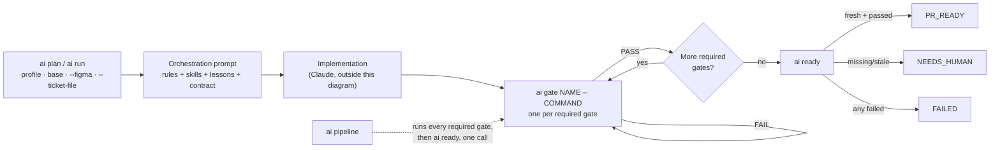
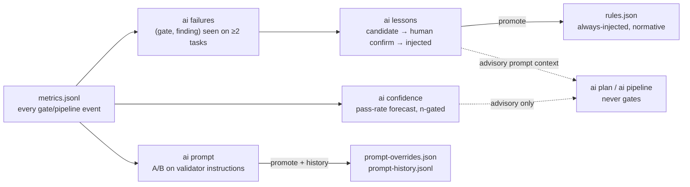

# Field Guide

A one-page reference: how a task moves through the stack, the three profiles,
every command, and how the learning system's data flows. For the *why* behind
each design decision, see [`architecture.md`](architecture.md); for the full
prose walkthrough of each feature, see the main [`README.md`](../README.md).

## How a task moves through the stack

Every gate's PASS is bound to a fingerprint of the repo, index, base, plan,
rules and validator config; any change invalidates it. `ai ready` never
launches a model — it only recomputes that fingerprint against what was
actually recorded.



## Three profiles, hard caps either way

Strict means stronger evidence and review, not unlimited agent debate. Every
number below is enforced, not advisory.

| Profile | Skills | Raw files | Review files | Findings | Context7 queries | Review rounds | Usage budget |
|---|---:|---:|---:|---:|---:|---:|---:|
| `fast` | 1 | 4 | 5 | 3 | 1 | 0 | 40,000 tok |
| `standard` | 2 | 8 | 10 | 3 | 3 | 1 | 120,000 tok |
| `strict` | 3 | 12 | 15 | 5 | 5 | 1 | 250,000 tok |

## Every command

**Core workflow**

| Command | Purpose |
|---|---|
| `ai init` | Detect languages/tooling for the current repo; first-run setup. |
| `ai plan "<task>"` | Build the orchestration prompt and task contract; print it (no launch). |
| `ai run "<task>"` | Same as `plan`, then launch Claude with the prompt. |
| `ai ready` | Certify `PR_READY`/`NEEDS_HUMAN`/`FAILED` from recorded gate evidence only. |
| `ai gate NAME -- CMD` | Run one gate's command, record its verdict/evidence/usage. |
| `ai pipeline [--dry-run\|--resume]` | Run every required gate in order, then `ai ready`. |
| `ai status` / `ai doctor` | Repo state summary / tool-availability + zero-footprint check. |
| `ai path` | Print this task's external state directory. |

**Setup, validators & context tools**

| Command | Purpose |
|---|---|
| `ai validators show\|install\|set\|remove` | Configure per-gate commands; `install` adds the bundled semantic ones. |
| `ai validate NAME` | Entry point the bundled validators use internally (run via `ai gate`, not directly). |
| `ai docs doctor\|setup\|detect\|library\|query` | Context7: version-specific library documentation. |
| `ai figma doctor\|setup` | Figma MCP connectivity for design-driven tasks. |
| `ai crg doctor\|build\|status\|update\|detect` | Code Review Graph: diff impact, blast radius, test gaps. |
| `ai graph doctor\|build\|sync\|query\|path\|explain` | Graphify: macro architecture, routes, communities. |

**Tickets, skills & rules**

| Command | Purpose |
|---|---|
| `ai ticket check --file\|--text\|-` | Analyze pasted ticket text: acceptance criteria, Figma link, mentioned blockers. |
| `ai skill list\|explain\|enable\|disable\|dry-run` | Inspect/tune the lazy skill router. |
| `ai handoff "<note>" --next "<step>"` | Write a compact resume-point for a follow-up session. |
| `ai optimize` | Print current token-policy/budget summary. |
| `ai rules list\|add\|remove` | Repository-specific conventions injected into every prompt. |

**Measurement (v0.9)**

| Command | Purpose |
|---|---|
| `ai metrics [--by ...] [--budget N]` | Gate/pipeline outcomes and token usage; dimensional report, CSV export, advisory budget. |
| `ai metrics prune --older-than SPEC --confirm` | Delete recorded events older than a window (human-gated). |
| `ai benchmark` | Routing/skill-selection comparison across profiles for fixed fixtures (no execution). |
| `ai benchmark run\|list\|report\|compare` | End-to-end sandboxed pipeline scenarios with pass/fail verdicts; fully isolated from real state. |

**Learning (v0.8)**

| Command | Purpose |
|---|---|
| `ai profile [--deep]` | Static project profile; `--deep` is an opt-in Codex read of architecture/stack/DB/deploy. |
| `ai confidence` | Historical pass-rate forecast card for the current change (advisory only). |
| `ai failures [show\|rebuild\|export]` | Recurring `(gate, finding)` patterns across tasks. |
| `ai lessons [derive\|add\|confirm\|reject\|retire\|promote\|prune]` | Empirical, human-curated context injected into future prompts. |
| `ai prompt [list\|show\|experiment\|report\|promote\|reset\|rollback\|history]` | A/B experiments and versioning on bundled validator instructions. |

## Learning system: what feeds what

Every phase reads the same append-only log and writes its own derived,
freely-recomputable view. Nothing here ever feeds back into gating — only a
gate's own fresh, fingerprinted evidence does that. Confidence and lessons
may only push toward more rigor: a repository with a perfect historical pass
rate still runs every required gate for a brand-new task.



## Zero-footprint: nothing lands in your checkout

Rules, contracts, gate logs, metrics and every learned artifact live outside
the repository, keyed to its normalized `origin` URL.

```text
~/.local/share/ai-agent-stack/           # engine
~/.config/ai-agent-stack/repos/<id>/     # everything this tool ever writes, per repository
  rules.json · validators.json · lessons.json · patterns.json
  prompt-overrides.json · prompt-history.jsonl · metrics.jsonl · benchmarks/
  tasks/<task-key>/  contracts/ · state/ · gates/ · review/ · handoffs/
~/work/repository/                       # your actual code — untouched
```

---

A searchable, visual version of this page (with a live command filter) is
also published as a Claude Artifact.
