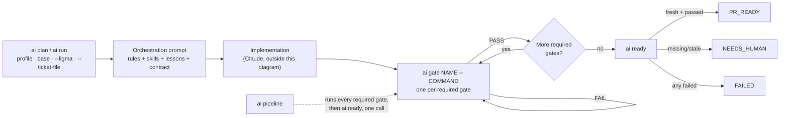
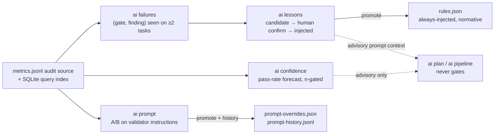

# Field Guide

A one-page reference: how a task moves through the stack, the three profiles,
and how the learning system's data flows. For every command and flag, use the
generated [`commands.md`](commands.md). For the *why* behind
each design decision, see [`architecture.md`](architecture.md); for the full
prose walkthrough of each feature, see the main [`README.md`](../README.md).

## How a task moves through the stack

Every gate's PASS is bound to a fingerprint of the repo, index, base, plan,
rules and validator config; any change invalidates it. `ai ready` never
launches a model — it only recomputes that fingerprint against what was
actually recorded.



## Three profiles, hard caps either way

Strict means stronger evidence and review, not unlimited agent debate. Every
number below is enforced, not advisory.

| Profile | Skills | Raw files | Review files | Findings | Context7 queries | Review rounds | Usage budget |
|---|---:|---:|---:|---:|---:|---:|---:|
| `fast` | 1 | 4 | 5 | 3 | 1 | 0 | 40,000 tok |
| `standard` | 2 | 8 | 10 | 3 | 3 | 1 | 120,000 tok |
| `strict` | 3 | 12 | 15 | 5 | 5 | 1 | 250,000 tok |

## Commands

The complete [command reference](commands.md) is generated from `argparse` and
checked in CI, so it cannot drift silently when commands or flags change.

## Learning system: what feeds what

Every phase reads the append-only audit log through a derived SQLite index and
writes its own freely-recomputable view. Nothing here ever feeds back into gating — only a
gate's own fresh, fingerprinted evidence does that. Confidence and lessons
may only push toward more rigor: a repository with a perfect historical pass
rate still runs every required gate for a brand-new task.



## Zero-footprint: nothing lands in your checkout

Rules, contracts, gate logs, metrics and every learned artifact live outside
the repository, keyed to its normalized `origin` URL.

```text
~/.local/share/ai-agent-stack/           # engine
~/.config/ai-agent-stack/repos/<id>/     # everything this tool ever writes, per repository
  rules.json · validators.json · lessons.json · patterns.json
  prompt-overrides.json · prompt-history.jsonl · metrics.jsonl · metrics.sqlite3 · benchmarks/
  tasks/<task-key>/  contracts/ · state/ · gates/ · review/ · handoffs/
~/work/repository/                       # your actual code — untouched
```

---

A searchable, visual version of this page (with a live command filter) is
also published as a Claude Artifact.
