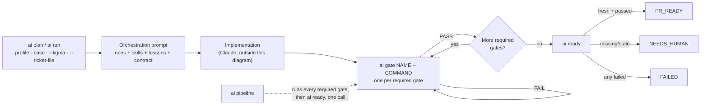
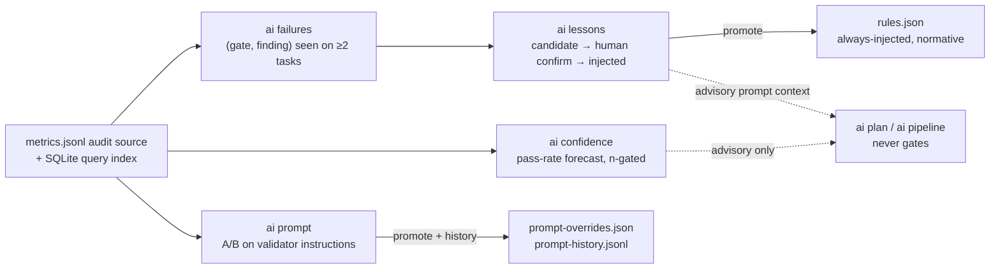

# Field Guide

A one-page reference: how a task moves through the stack, the three profiles,
and how the learning system's data flows. For every command and flag, use the
generated [`commands.md`](commands.md). For the *why* behind
each design decision, see [`architecture.md`](architecture.md); for the full
prose walkthrough of each feature, see the main [`README.md`](../README.md).

## The short path

Three commands cover the normal case. Each is a composition over the granular
commands below — same prompt builder, same gate recorder, same readiness check.

```bash
ai init                              # once per repo: records the base, reports detected tooling
ai validators propose --apply        # once per repo: configures checks/regression
ai validators install                # once per repo: configures the semantic gates

ai start LOGIN-42 --ticket-file ticket.md   # fresh contract, becomes the active task
ai work                                      # plan + launch the builder for that task
ai finish                                    # run every required gate, then certify
ai close --reason "merged"                   # freeze the evidence
```

`ai current` shows what is active at any point; `ai tasks` lists everything in
this checkout. A task carries its own base, so `ai start --base release` keeps
one task on a different branch than the rest without a flag on every command.

## How a task moves through the stack

Every gate's PASS is bound to a fingerprint of the repo, index, base, plan,
rules and validator config; any change invalidates it. `ai ready` never
launches a model — it only recomputes that fingerprint against what was
actually recorded.



## Three profiles, hard caps either way

Strict means stronger evidence and review, not unlimited agent debate. Every
number below is enforced, not advisory.

| Profile | Skills | Raw files | Review files | Findings | Context7 queries | Review rounds | Usage budget |
|---|---:|---:|---:|---:|---:|---:|---:|
| `fast` | 1 | 4 | 5 | 3 | 1 | 0 | 40,000 tok |
| `standard` | 2 | 8 | 10 | 3 | 3 | 1 | 120,000 tok |
| `strict` | 3 | 12 | 15 | 5 | 5 | 1 | 250,000 tok |

## Commands

The complete [command reference](commands.md) is generated from `argparse` and
checked in CI, so it cannot drift silently when commands or flags change.

## Learning system: what feeds what

Every phase reads the append-only audit log through a derived SQLite index and
writes its own freely-recomputable view. Nothing here ever feeds back into gating — only a
gate's own fresh, fingerprinted evidence does that. Confidence and lessons
may only push toward more rigor: a repository with a perfect historical pass
rate still runs every required gate for a brand-new task.



## Running a real-usage validation campaign

The stack cannot tell you whether it is actually working — only a human running it
against real tasks can. `ai metrics label`/`ai metrics --campaign` are instrumentation
for that, not a substitute for doing it:

```bash
# After a gate fails, judge it while the context is fresh (ideally within 24h):
ai metrics label checks --task-key <key> --false-positive   # the gate was wrong to block
ai metrics label security --task-key <key> --true-positive  # the gate caught a real issue

# Find a task's key from a closed task's directory name, or:
ai metrics --all-tasks --by task --json

# After 20-30 tasks across task types and profiles:
ai metrics --campaign
```

The report is stratified by `task_type` (time to `PR_READY`, retries, tokens) and by
`profile` (tokens against that profile's budget), and turns three fixed thresholds
into plain-language recommendations: a gate's false-positive rate over 20% suggests
making it advisory; a task type whose p90 time-to-ready is over 3x its median names
the gate dominating that group's duration; a profile eating over 80% of its token
budget suggests recalibrating `context_caps`. `findings_raised` is a volume count,
not a claim about what got ignored — the stack cannot distinguish an override from a
genuine fix without an explicit label.

## Zero-footprint: nothing lands in your checkout

Rules, contracts, gate logs, metrics and every learned artifact live outside
the repository, keyed to its normalized `origin` URL.

```text
~/.local/share/ai-agent-stack/           # engine
~/.config/ai-agent-stack/repos/<id>/     # everything this tool ever writes, per repository
  rules.json · validators.json · lessons.json · patterns.json
  prompt-overrides.json · prompt-history.jsonl · metrics.jsonl · metrics.sqlite3 · benchmarks/
  tasks/<task-key>/  contracts/ · state/ · gates/ · review/ · handoffs/
~/work/repository/                       # your actual code — untouched
```

---

A searchable, visual version of this page (with a live command filter) is
also published as a Claude Artifact.
