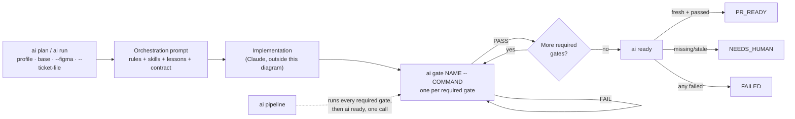
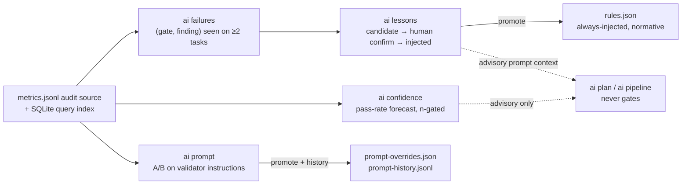

# Field Guide

A one-page reference: how a task moves through the stack, the three profiles,
and how the learning system's data flows. For every command and flag, use the
generated [`commands.md`](commands.md). For the *why* behind
each design decision, see [`architecture.md`](architecture.md); for the full
prose walkthrough of each feature, see the main [`README.md`](../README.md).

## The short path

Three commands cover the normal case. Each is a composition over the granular
commands below — same prompt builder, same gate recorder, same readiness check.

```bash
ai init                              # once per repo: records the base, reports detected tooling
ai validators propose --apply        # once per repo: configures checks/regression
ai validators install                # once per repo: configures the semantic gates

ai start LOGIN-42 --ticket-file ticket.md   # fresh contract from the ticket; baseline checks run
ai work                                      # plan + launch the builder (open gate findings included)
ai finish                                    # run every required gate, then certify
ai close --reason "merged"                   # freeze the evidence; record the builder's usage
```

`ai current` shows what is active at any point; `ai tasks` lists everything in
this checkout. A task carries its own base, so `ai start --base release` keeps
one task on a different branch than the rest without a flag on every command.

What each step now catches for you:

- **`ai start`** fills the contract's objective, acceptance, `must_not_change` and
  risk notes from the ticket's own headings (English or Spanish), runs the configured
  `checks` once on the starting tree and says if it is already red, and warns when
  the base is more than 2,000 changed lines away. `--no-baseline` skips the run.
- **`ai work`** keeps the contract's objective, lists every gate's open findings in
  the builder's prompt, and launches Claude without `Co-Authored-By` trailers.
- **`ai finish`** refuses to re-run a model-judged gate that already FAILed on the
  exact same code — fix its findings first — and does not count a command that could
  not run (exit 126/127) or a stale prerequisite as a retry.
- **Wait for the builder to finish** before `ai finish`: a gate that sees the
  repository change while it runs is discarded.
- **`ai loop`** runs builder and gates round after round without you, stopping at
  `PR_READY` or at the first decision that is yours (round limit, moved base, budget).
  Each round's builder cost, turns and denied commands are recorded (`builder_round`).

## How a task moves through the stack

Every gate's PASS is bound to a fingerprint of the repo's tree, index, base,
plan, rules, validator config, the stack version and the active builder/reviewer
providers; any change invalidates it. Commit messages only count for `summary` and
`provenance`, so rewording a commit re-runs those two, not the code review.
`contract`, `review` and `security` share one reviewer call, as do `summary`,
`cleanup`, `ponytail` and `provenance`. `ai ready` never launches a model — it
only recomputes that fingerprint against what was actually recorded.


```mermaid
flowchart LR
    A["ai plan / ai run<br/>profile · base · --figma · --ticket-file"] --> B["Orchestration prompt<br/>rules + skills + lessons + contract"]
    B --> C["Implementation<br/>(Claude, outside this diagram)"]
    C --> D["ai gate NAME -- COMMAND<br/>one per required gate"]
    D -->|PASS| E{More required<br/>gates?}
    D -->|FAIL| D
    E -->|yes| D
    E -->|no| F["ai ready"]
    F -->|fresh + passed| G["PR_READY"]
    F -->|missing/stale| H["NEEDS_HUMAN"]
    F -->|any failed| I["FAILED"]
    J["ai pipeline"] -.->|runs every required gate,<br/>then ai ready, one call| D
```

## Three profiles, hard caps either way

Strict means stronger evidence and review, not unlimited agent debate. Every
number below is enforced, not advisory.

| Profile | Skills | Raw files | Review files | Findings | Context7 queries | Review rounds | Retries | Token budget | Cost budget |
|---|---:|---:|---:|---:|---:|---:|---:|---:|---:|
| `fast` | 1 | 4 | 5 | 3 | 1 | 0 | 1 | 160,000 tok | $0.50 |
| `standard` | 2 | 8 | 10 | 3 | 3 | 1 | 2 | 230,000 tok | $1.50 |
| `strict` | 3 | 12 | 15 | 5 | 5 | 1 | 2 | 300,000 tok | $3.00 |

`retries` is a per-gate streak cap: once a gate has failed that many times in
a row without passing, `ai gate`/`ai pipeline` stop with `NEEDS_HUMAN` rather
than spend another model call. `ai pipeline` enforces both the token and cost
budgets, checked before and after each gate; the cost budget only bites where
the provider reports `cost_usd`. `--allow-overrun` continues past any of them.

## Commands

The complete [command reference](commands.md) is generated from `argparse` and
checked in CI, so it cannot drift silently when commands or flags change.

## Learning system: what feeds what

Every phase reads the append-only audit log through a derived SQLite index and
writes its own freely-recomputable view. Nothing here ever feeds back into gating — only a
gate's own fresh, fingerprinted evidence does that. Confidence and lessons
may only push toward more rigor: a repository with a perfect historical pass
rate still runs every required gate for a brand-new task.


```mermaid
flowchart LR
    M["metrics.jsonl audit source<br/>+ SQLite query index"] --> P["ai failures<br/>(gate, finding) seen on ≥2 tasks"]
    P --> L["ai lessons<br/>candidate → human confirm → injected"]
    L -->|promote| RULES["rules.json<br/>always-injected, normative"]
    M --> C["ai confidence<br/>pass-rate forecast, n-gated"]
    M --> PR["ai prompt<br/>A/B on validator instructions"]
    PR -->|promote + history| PO["prompt-overrides.json<br/>prompt-history.jsonl"]
    C -.->|advisory only| PLAN["ai plan / ai pipeline<br/>never gates"]
    L -.->|advisory prompt context| PLAN
```

## Running a real-usage validation campaign

The stack cannot tell you whether it is actually working — only a human running it
against real tasks can. `ai metrics label`/`ai metrics --campaign` are instrumentation
for that, not a substitute for doing it:

```bash
# After a gate fails, judge it while the context is fresh (ideally within 24h):
ai metrics label checks --task-key <key> --false-positive   # the gate was wrong to block
ai metrics label security --task-key <key> --true-positive  # the gate caught a real issue

# Find a task's key from a closed task's directory name, or:
ai metrics --all-tasks --by task --json

# After 20-30 tasks across task types and profiles:
ai metrics --campaign
```

The report is stratified by `task_type` (time to `PR_READY`, retries, tokens) and by
`profile` (tokens against that profile's budget), and turns three fixed thresholds
into plain-language recommendations: a gate's false-positive rate over 20% suggests
making it advisory; a task type whose p90 time-to-ready is over 3x its median names
the gate dominating that group's duration; a profile eating over 80% of its token
budget suggests recalibrating `context_caps`. `findings_raised` is a volume count,
not a claim about what got ignored — the stack cannot distinguish an override from a
genuine fix without an explicit label.

Gate tokens in the report are **billable** (cache hits excluded, as the budget counts
them). Attempts blocked by the environment or a stale prerequisite are reported apart
from retries. The builder's own usage, per model, is read from Claude Code's
transcripts when the task is closed and shown beside the gates'.

The protocol for running one — scope, baseline arm, decision rules fixed in advance,
and a per-task log template — is in [`campaign-protocol.md`](campaign-protocol.md).
Task-by-task findings are kept privately, outside this repository.

## Zero-footprint: nothing lands in your checkout

Rules, contracts, gate logs, metrics and every learned artifact live outside
the repository, keyed to its normalized `origin` URL.

```text
~/.local/share/ai-agent-stack/           # engine
~/.config/ai-agent-stack/repos/<id>/     # everything this tool ever writes, per repository
  rules.json · validators.json · lessons.json · patterns.json
  prompt-overrides.json · prompt-history.jsonl · metrics.jsonl · metrics.sqlite3 · benchmarks/
  tasks/<task-key>/  contracts/ · state/ · gates/ · review/ · handoffs/
~/work/repository/                       # your actual code — untouched
```

---

A searchable, visual version of this page (with a live command filter) is
also published as a Claude Artifact.
